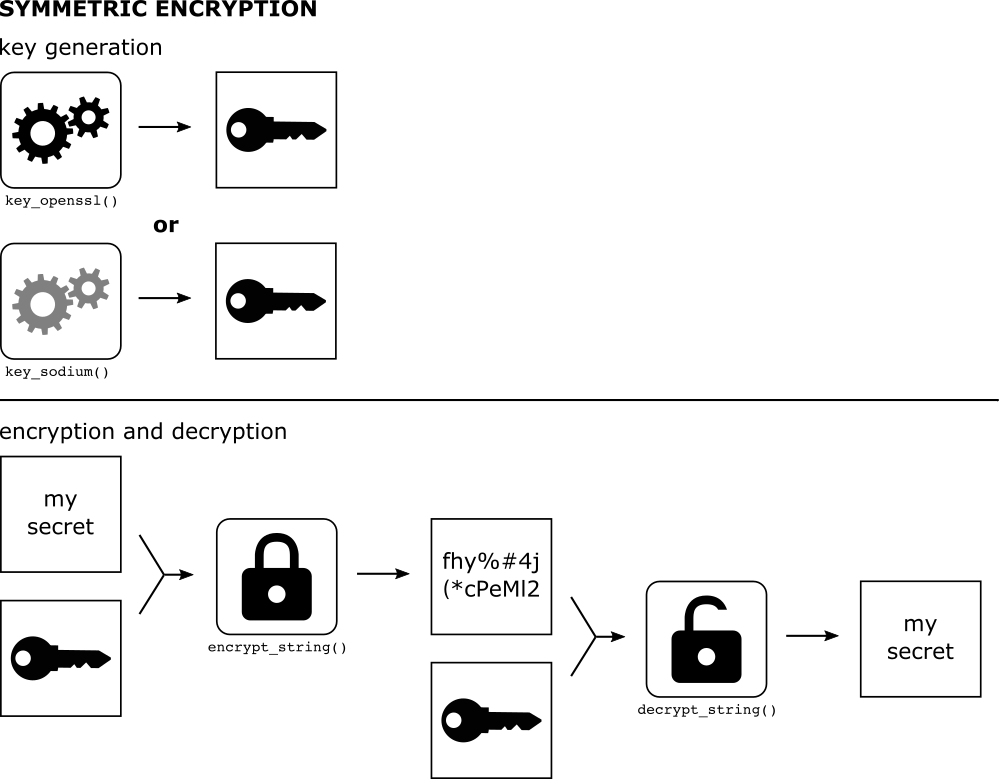
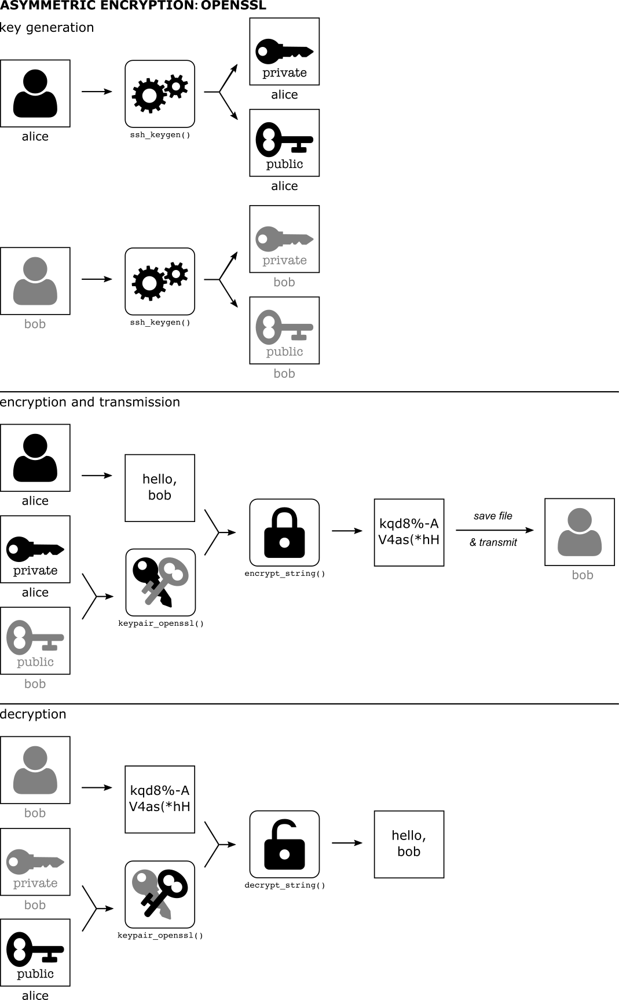

# Introduction

This package tries to smooth over some of the differences in encryption
approaches (symmetric vs. asymmetric, sodium vs. openssl) to provide a
simple interface for users who just want to encrypt or decrypt things.

The scope of the package is to protect data that has been saved to disk.
It is not designed to stop an attacker targeting the R process itself to
determine the contents of sensitive data. The package does try to
prevent you accidentally saving to disk the contents of sensitive
information, including the keys that could decrypt such information.

This vignette works through the basic functionality of the package. It
does not offer much in the way of an introduction to encryption itself;
for that see the excellent vignettes in the `openssl` and `sodium`
packages (see `vignette("crypto101")` and `vignette("bignum")` for
information about how encryption works). This package is a wrapper
around those packages in order to make them more accessible.

## Keys and the like

To encrypt anything we need a key. There are two sorts of key “types” we
will concern ourselves with here “symmetric” and “asymmetric”.

- “symmetric” keys are used for storing secrets that multiple people
  need to access. Everyone has the same key (which is just a bunch of
  bytes) and with that we can either encrypt data or decrypt it.

- a “key pair” is a public and a private key; this is used in
  communication. You hold a private key that nobody else ever sees and a
  public key that you can copy around all over the show. These can be
  used for a couple of different patterns of communication (see below).

We support symmetric keys and asymmetric key pairs from the `openssl`
and `sodium` packages (which wrap around industry-standard cryptographic
libraries) - this vignette will show how to create and load keys of
different types as they’re used.

The `openssl` keys have the advantage of a standard key format, and that
many people (especially on Linux and macOS) have a keypair already (see
below if you’re not sure if you do). The `sodium` keys have the
advantage of being a new library, starting from a clean slate rather
than carrying with it accumulated ideas from the last 20 years of
development.

The idea in `cyphr` is that we can abstract away some differences in the
types of keys and the functions that go with them to create a
standardised interface to encrypting and decrypting strings, R objects,
files and raw vectors. With that, we can then create wrappers around
functions that create files and simplify the process of adding
encryption into a data workflow.

Below, I’ll describe the sorts of keys that `cyphr` supports and in the
sections following describe how these can be used to actually do some
encryption.

### Symmetric encryption



Illustration of Symmetric Encryption

This is the simplest form of encryption because everyone has the same
key (like a key to your house or a single password). This raises issues
(like how do you *store* the key without other people reading it) but we
can deal with that below.

#### `openssl`

To generate a key with `openssl`, you can use:

``` r

k <- openssl::aes_keygen()
```

which generates a raw vector

``` r

k
```

    ## aes 52:e5:af:46:41:e4:b4:9b:78:c1:54:b8:e3:0c:14:f1

(this prints nicely but it really is stored as a 16 byte raw vector).

The encryption functions that this key supports are
[`openssl::aes_cbc_encrypt`](https://jeroen.r-universe.dev/openssl/reference/aes_cbc.html),
[`openssl::aes_ctr_encrypt`](https://jeroen.r-universe.dev/openssl/reference/aes_cbc.html)
and
[`openssl::aes_gcm_encrypt`](https://jeroen.r-universe.dev/openssl/reference/aes_cbc.html)
(along with the corresponding decryption functions). The `cyphr` package
tries to abstract this away by using a wrapper \`cyphr::key_openssl

``` r

key <- cyphr::key_openssl(k)
key
```

    ## <cyphr_key: openssl>

With this key, one can encrypt a string with
[`cyphr::encrypt_string`](https://docs.ropensci.org/cyphr/reference/encrypt_data.md):

``` r

secret <- cyphr::encrypt_string("my secret string", key)
```

and decrypt it again with
[`cyphr::decrypt_string`](https://docs.ropensci.org/cyphr/reference/encrypt_data.md):

``` r

cyphr::decrypt_string(secret, key)
```

    ## [1] "my secret string"

See below for more functions that use these key objects.

#### `sodium`

The interface is almost identical using sodium symmetric keys. To
generate a symmetric key with libsodium you would use
[`sodium::keygen`](https://docs.ropensci.org/sodium/reference/keygen.html)

``` r

k <- sodium::keygen()
```

This is really just a raw vector of length 32, without even any class
attribute!

The encryption functions that this key supports are
[`sodium::data_encrypt`](https://docs.ropensci.org/sodium/reference/symmetric.html)
and
[`sodium::data_decrypt`](https://docs.ropensci.org/sodium/reference/symmetric.html).
To create a key for use with `cyphr` that knows this, use:

``` r

key <- cyphr::key_sodium(k)
key
```

    ## <cyphr_key: sodium>

This key can then be used with the high-level cyphr encryption functions
described below.

### Asymmetric encryption (“key pairs”)



Illustration of Asymmetric Encryption

With asymmetric encryption everybody has two keys that differ from
everyone else’s key. One key is public and can be shared freely with
anyone you would like to communicate with and the other is private and
must never be disclosed.

In the `sodium` package there is a vignette (`vignette("crypto101")`)
that gives a gentle introduction to how this all works. In practice, you
end up creating a pair of keys for yourself. Then to encrypt or decrypt
something you encrypt messages with the recipient’s *public key* and
they (and only they) can decrypt it with their *private key*.

One use for asymmetric encryption is to encrypt a shared secret (such as
a symmetric key) - with this you can then safely store or communicate a
symmetric key without disclosing it.

#### `openssl`

Let’s suppose that we have two parties “Alice” and “Bob” who want to
talk with one another. For demonstration purposes we need to generate
SSH keys (with no password) in temporary directories (to comply with
CRAN policies). In a real situation these would be on different machines
(Alice has no access to Bob’s key!) and these keys would be password
protected.

``` r

path_key_alice <- cyphr::ssh_keygen(password = FALSE)
path_key_bob <- cyphr::ssh_keygen(password = FALSE)
```

Note that each directory contains a public key (`id_rsa.pub`) and a
private key (`id_rsa`).

``` r

dir(path_key_alice)
```

    ## [1] "id_rsa"     "id_rsa.pub"

``` r

dir(path_key_bob)
```

    ## [1] "id_rsa"     "id_rsa.pub"

Below, the full path to the key (e.g., `.../id_rsa`) could be used in
place of the directory name if you prefer.

If Alice wants to send a message to Bob she needs to use her private key
and his public key

``` r

pair_a <- cyphr::keypair_openssl(path_key_bob, path_key_alice)
pair_a
```

    ## <cyphr_keypair: openssl>

with this pair she can write a message to “bob”:

``` r

secret <- cyphr::encrypt_string("secret message", pair_a)
```

The secret is now just a big pile of bytes

``` r

secret
```

    ##   [1] 58 0a 00 00 00 03 00 04 06 00 00 03 05 00 00 00 00 05 55 54 46 2d 38 00 00
    ##  [26] 02 13 00 00 00 04 00 00 00 18 00 00 00 10 4b 63 ff 10 0a a6 08 75 78 be 23
    ##  [51] a8 82 4d 8c 35 00 00 00 18 00 00 01 00 69 e0 c3 f3 28 a5 27 44 48 c9 67 61
    ##  [76] 2f e0 b4 c0 ec 5b 2a da 95 12 cf af 7d 2e e9 d4 a9 bd 12 5f 74 10 3e 5a 87
    ## [101] 96 d5 e1 18 b9 68 e2 ff 62 30 10 f4 38 76 72 2d f3 ff 2e f4 c4 8f 04 91 96
    ## [126] fa 17 c9 7e 49 1c e0 b4 63 0b 35 61 1d 40 2f 34 64 c0 76 47 1b 2a 34 71 e2
    ## [151] 1c 51 3d 4d 4b 37 0d dd 6f df c9 e9 98 50 e5 2f 17 e7 4e 99 22 1f 84 a5 47
    ## [176] 48 1c 19 b9 48 4c 8b 20 e4 58 ea 54 6b 8c d2 c8 3c 53 53 eb 16 b4 32 a3 08
    ## [201] 66 a7 89 5e 7d c4 43 cd fa e6 d6 39 7d 4c c4 f9 ae 51 d1 e5 75 68 c1 08 0b
    ## [226] f9 53 3e f7 94 d7 82 d9 55 69 68 fe bd 97 55 a4 1c 19 d0 56 90 b9 84 6a 77
    ## [251] 81 c2 e9 a2 e6 5b 7e 10 e7 a1 d7 ec 40 2c 56 dd a8 2c 39 24 d2 1e 5a 80 89
    ## [276] ca d2 8d e3 41 c9 fc b1 88 f4 aa 5a 28 ad de b5 0a eb 23 d9 63 c3 d0 b3 16
    ## [301] 01 eb 02 6e 34 63 1f 3d 60 10 ba da ea c7 8e 9b 2f 87 45 00 00 00 18 00 00
    ## [326] 00 10 ca ee b0 82 91 5c e9 15 d3 f7 c9 77 04 ef f5 fa 00 00 00 18 00 00 01
    ## [351] 00 59 cd 13 3f b1 de 69 97 ec 27 5d a1 a0 15 e8 62 4f 48 a7 5e e5 fa 6c 48
    ## [376] 3b bd 2e c7 14 41 94 cd 50 f2 fb 0a 6f 3a 67 ac 00 05 22 04 bc 2b ed 5b a7
    ## [401] fa b3 24 34 69 8a 56 83 e9 da 75 2f 33 d3 f8 1f 87 a1 c0 4d 0f 3d cf ef 64
    ## [426] b5 23 5b c4 79 a0 0f 79 59 e7 11 00 d2 dc 4f dd 4d 5b 04 f3 41 91 e6 15 05
    ## [451] 96 a5 72 6f b1 f7 36 63 fb 1c 3f 73 80 1e 42 af 82 54 28 0a 00 52 24 45 43
    ## [476] 85 eb b4 5f cc ae 5d 38 9e 0e 5e b9 87 44 25 70 ba e7 09 d1 11 93 72 5f ba
    ## [501] 45 f8 a7 18 15 57 46 2c 6f d4 35 ca c6 b9 67 aa 82 76 6b aa ff 34 93 75 70
    ## [526] 56 b9 08 a1 fd 8f 51 bf d4 ab fc 42 a9 3b 89 7e 8f c6 b0 0d 27 aa a4 63 d9
    ## [551] 3c 00 22 fa 42 fa 27 a8 5e 80 37 8f a7 9c d8 9d 95 a0 ac cb 40 4f e1 58 8a
    ## [576] 24 e1 01 18 ce 71 f5 9f ca e9 03 2e 36 19 e5 07 8d 4d 8e 89 a6 52 93 ed 7f
    ## [601] 15 c7 4a 95 07 19 f7 00 00 04 02 00 00 00 01 00 04 00 09 00 00 00 05 6e 61
    ## [626] 6d 65 73 00 00 00 10 00 00 00 04 00 04 00 09 00 00 00 02 69 76 00 04 00 09
    ## [651] 00 00 00 07 73 65 73 73 69 6f 6e 00 04 00 09 00 00 00 04 64 61 74 61 00 04
    ## [676] 00 09 00 00 00 09 73 69 67 6e 61 74 75 72 65 00 00 00 fe

Note that unlike symmetric encryption above, Alice cannot decrypt her
own message:

``` r

cyphr::decrypt_string(secret, pair_a)
```

    ## Error in `openssl::decrypt_envelope()`:
    ## ! OpenSSL error: 007876086B7F0000:error:03000082:digital envelope routines:EVP_CIPHER_CTX_set_key_length:invalid key length:../crypto/evp/evp_enc.c:1046:

For Bob to read the message, he uses his private key and Alice’s public
key (which she has transmitted to him previously).

``` r

pair_b <- cyphr::keypair_openssl(path_key_alice, path_key_bob)
```

With this keypair, Bob can decrypt Alice’s message

``` r

cyphr::decrypt_string(secret, pair_b)
```

    ## [1] "secret message"

And send one back of his own:

``` r

secret2 <- cyphr::encrypt_string("another message", pair_b)
secret2
```

    ##   [1] 58 0a 00 00 00 03 00 04 06 00 00 03 05 00 00 00 00 05 55 54 46 2d 38 00 00
    ##  [26] 02 13 00 00 00 04 00 00 00 18 00 00 00 10 df 00 b1 c3 a8 e7 fd b7 d6 72 66
    ##  [51] fe 40 53 67 8a 00 00 00 18 00 00 01 00 20 3d 42 54 42 24 40 16 82 c6 6b b9
    ##  [76] ee 73 b9 a9 3d 57 6e 94 e0 4f b5 88 76 7b 7c e8 4e f1 c8 d5 fe ec 8b f6 9d
    ## [101] 46 00 8b 0e 44 f2 21 bc 82 f6 3d 39 24 4f 13 af 97 e1 c8 3d f8 1e 39 0a ac
    ## [126] 92 e5 ca 33 29 b1 b1 06 1a fb 78 e3 8c f8 60 1f e9 3d 6f 7a 4c ac 46 46 e7
    ## [151] 8f e4 fd d7 44 7a a3 97 fa cc f0 10 37 60 1a 68 2b 57 af 91 37 6e 1d 89 9e
    ## [176] b9 2d 72 c4 48 2a ec 68 92 88 3d 47 c9 67 16 f2 b1 46 78 8a 21 cb 64 97 a6
    ## [201] 7e 80 26 ae f3 94 ae 05 b2 23 5b e7 a6 78 c2 df f3 72 42 10 b2 64 f7 f4 fa
    ## [226] d2 be fb 37 a5 cb e2 e7 48 a9 cd 64 5c 03 f4 c5 33 b8 47 93 e8 44 5f 3f ec
    ## [251] 32 cb d3 b6 a3 56 05 9e 04 bb 18 a9 10 c7 45 46 43 ff 9f 48 4d e8 ff f3 f7
    ## [276] 86 8a bf 0a 07 37 6a f0 fe 67 27 e5 94 7b e4 d9 71 7a fa 56 7d 1c ab bd 64
    ## [301] 78 2f 13 94 67 7c 83 cd 70 06 f2 f3 36 1b db 02 41 85 fd 00 00 00 18 00 00
    ## [326] 00 10 03 e0 75 9b 2e 0a 1a 7f 14 3d 6d ce 54 99 18 ec 00 00 00 18 00 00 01
    ## [351] 00 73 c2 3e 11 d8 e8 59 f3 c2 db 7f 76 17 18 cf 70 be fd c3 a4 0f 69 c0 e5
    ## [376] 49 06 f0 16 85 81 17 83 84 bd 70 56 65 f0 32 74 fe b0 fe 4f 6c a9 88 1a 71
    ## [401] 49 f4 bf 23 e5 72 6b 1a 8f 10 ac e0 4b d0 48 fc 8a 23 0d 1c 71 79 76 d9 38
    ## [426] 97 3f e3 74 91 a9 d3 ef e2 7e ce 5e 47 2d 42 1b 70 52 ba 77 bb f1 b9 d6 7a
    ## [451] ac f8 62 00 d6 ec f5 47 bc 6e 49 69 2e 09 f7 79 0d 50 13 21 1c 41 ee 2a 70
    ## [476] 40 dd f6 35 a8 ac 10 96 0c 54 11 f9 f0 8f a3 f5 ba ac 33 a0 51 ca 89 37 78
    ## [501] 0d 3d 65 93 9e 7f 3d 50 0d 5f ab 38 da 62 d4 03 fe 8f 1d a5 52 d2 4d ec fa
    ## [526] fc 60 9b 95 2a 6c fd 03 01 d1 e4 26 9b fd 6d 89 a2 92 7f b9 9b 20 07 35 d1
    ## [551] 44 ac b9 ba 84 eb 2c 63 a1 09 c8 eb 63 3d 13 23 a4 e4 96 7a d6 04 9f 70 b8
    ## [576] fc 8c 83 71 3d 49 b8 27 b7 20 53 ec 60 79 12 02 6c a7 f2 f4 57 fb 1f 6c ab
    ## [601] 0e a9 70 9c 6d 37 bf 00 00 04 02 00 00 00 01 00 04 00 09 00 00 00 05 6e 61
    ## [626] 6d 65 73 00 00 00 10 00 00 00 04 00 04 00 09 00 00 00 02 69 76 00 04 00 09
    ## [651] 00 00 00 07 73 65 73 73 69 6f 6e 00 04 00 09 00 00 00 04 64 61 74 61 00 04
    ## [676] 00 09 00 00 00 09 73 69 67 6e 61 74 75 72 65 00 00 00 fe

which she can decrypt

``` r

cyphr::decrypt_string(secret2, pair_a)
```

    ## [1] "another message"

Chances are, you have an openssl keypair in your `.ssh/` directory. If
so, you would pass `NULL` as the path for the private (or less usefully,
the public) key pair part. So to send a message to Bob, we’d include the
path to Bob’s public key.

``` r

pair_us <- cyphr::keypair_openssl(path_key_bob, NULL)
```

This all skips over how Alice and Bob will exchange this secret
information. Because the secret is bytes, it’s a bit odd to work with.
Alice could save the secret to disk with

``` r

secret <- cyphr::encrypt_string("secret message", pair_a)
path_for_bob <- file.path(tempdir(), "for_bob_only")
writeBin(secret, path_for_bob)
```

And then send Bob the file `for_bob_only` (over email or any other
insecure medium).

and bob could read the secret in with:

``` r

secret <- readBin(path_for_bob, raw(), file.size(path_for_bob))
cyphr::decrypt_string(secret, pair_b)
```

    ## [1] "secret message"

As an alternative, you can “base64 encode” the bytes into something that
you can just email around:

``` r

secret_base64 <- openssl::base64_encode(secret)
secret_base64
```

    ## [1] "WAoAAAADAAQGAAADBQAAAAAFVVRGLTgAAAITAAAABAAAABgAAAAQ3JBNPRWWO2GsS4Xg1Q7+RAAAABgAAAEAfk6bifqadi02/oabMo8HgrzsdqXv/tfM0MCMW1YEw+JXDiTW0oP8jboZtZP4GxctbVWaksYBQS4Os7I58x1j9sMEkLFeD26swef2kqfNU/ISQ60SK7Lyq37IBOmvwmo1E1GpC98DaajOOKP9J64CXdWDDPQYI05ILmHYSAWl64tWZKHbe0dXtrY3or+Br/SI8ExUdwcLXZ9Yh8CjFCuaRqlMLmd6q04tRrEiUlshB8rCEfN4dfOsvkZdRAxPeklYHIBxsgGQrHdFIgMMPfyweSYtz6KuzTbrX8Z8OVeuxaZouu4BcxdzDlSxBqtDTpKz0dp4CgulLhTzM6tbWCDzvgAAABgAAAAQT2jc6qGGyzB6fZ998Ok+hQAAABgAAAEAWc0TP7HeaZfsJ12hoBXoYk9Ip17l+mxIO70uxxRBlM1Q8vsKbzpnrAAFIgS8K+1bp/qzJDRpilaD6dp1LzPT+B+HocBNDz3P72S1I1vEeaAPeVnnEQDS3E/dTVsE80GR5hUFlqVyb7H3NmP7HD9zgB5Cr4JUKAoAUiRFQ4XrtF/Mrl04ng5euYdEJXC65wnREZNyX7pF+KcYFVdGLG/UNcrGuWeqgnZrqv80k3VwVrkIof2PUb/Uq/xCqTuJfo/GsA0nqqRj2TwAIvpC+ieoXoA3j6ec2J2VoKzLQE/hWIok4QEYznH1n8rpAy42GeUHjU2OiaZSk+1/FcdKlQcZ9wAABAIAAAABAAQACQAAAAVuYW1lcwAAABAAAAAEAAQACQAAAAJpdgAEAAkAAAAHc2Vzc2lvbgAEAAkAAAAEZGF0YQAEAAkAAAAJc2lnbmF0dXJlAAAA/g=="

This can be converted back with
[`openssl::base64_decode`](https://jeroen.r-universe.dev/openssl/reference/base64_encode.html):

``` r

identical(openssl::base64_decode(secret_base64), secret)
```

    ## [1] TRUE

Or, less compactly but also suitable for email, you might just convert
the bytes into their hex representation:

``` r

secret_hex <- sodium::bin2hex(secret)
secret_hex
```

    ## [1] "580a000000030004060000030500000000055554462d3800000213000000040000001800000010dc904d3d15963b61ac4b85e0d50efe4400000018000001007e4e9b89fa9a762d36fe869b328f0782bcec76a5effed7ccd0c08c5b5604c3e2570e24d6d283fc8dba19b593f81b172d6d559a92c601412e0eb3b239f31d63f6c30490b15e0f6eacc1e7f692a7cd53f21243ad122bb2f2ab7ec804e9afc26a351351a90bdf0369a8ce38a3fd27ae025dd5830cf418234e482e61d84805a5eb8b5664a1db7b4757b6b637a2bf81aff488f04c5477070b5d9f5887c0a3142b9a46a94c2e677aab4e2d46b122525b2107cac211f37875f3acbe465d440c4f7a49581c8071b20190ac774522030c3dfcb079262dcfa2aecd36eb5fc67c3957aec5a668baee017317730e54b106ab434e92b3d1da780a0ba52e14f333ab5b5820f3be00000018000000104f68dceaa186cb307a7d9f7df0e93e85000000180000010059cd133fb1de6997ec275da1a015e8624f48a75ee5fa6c483bbd2ec7144194cd50f2fb0a6f3a67ac00052204bc2bed5ba7fab32434698a5683e9da752f33d3f81f87a1c04d0f3dcfef64b5235bc479a00f7959e71100d2dc4fdd4d5b04f34191e6150596a5726fb1f73663fb1c3f73801e42af8254280a005224454385ebb45fccae5d389e0e5eb987442570bae709d11193725fba45f8a7181557462c6fd435cac6b967aa82766baaff3493757056b908a1fd8f51bfd4abfc42a93b897e8fc6b00d27aaa463d93c0022fa42fa27a85e80378fa79cd89d95a0accb404fe1588a24e10118ce71f59fcae9032e3619e5078d4d8e89a65293ed7f15c74a950719f7000004020000000100040009000000056e616d6573000000100000000400040009000000026976000400090000000773657373696f6e00040009000000046461746100040009000000097369676e6174757265000000fe"

and the reverse with
[`sodium::hex2bin`](https://docs.ropensci.org/sodium/reference/helpers.html):

``` r

identical(sodium::hex2bin(secret_hex), secret)
```

    ## [1] TRUE

(this is somewhat less space efficient than base64 encoding.

As a final option, you can just save the secret with `saveRDS` and read
it in with `readRDS` like any other option. This will be the best route
if the secret is saved into a more complicated R object (e.g., a list or
`data.frame`).

See the other cyphr vignette
([`vignette("data", package = "cyphr")`](https://docs.ropensci.org/cyphr/articles/data.md))
for a suggested workflow for exchanging secrets within a team, and the
wrapper functions below for more convenient ways of working with
encrypted data.

**Do you already have an ssh keypair?** To find out, run

``` r

cyphr::keypair_openssl(NULL, NULL)
```

One of three things will happen:

1.  you will be prompted for your password to decrypt your private key,
    and then after entering it an object `<cyphr_keypair: openssl>` will
    be returned - you’re good to go!

2.  you were *not* prompted for your password, but got a
    `<cyphr_keypair: openssl>` object. You should consider whether this
    is appropriate and consider generating a new keypair with the
    private key encrypted. If you don’t then anyone who can read your
    private key can decrypt any message intended for you.

3.  you get an error like
    `Did not find default ssh public key at ~/.ssh/id_rsa.pub`. You need
    to create a keypair.

To create a keypair, you can use the
[`cyphr::ssh_keygen()`](https://docs.ropensci.org/cyphr/reference/ssh_keygen.md)
function as

``` r

cyphr::ssh_keygen("~/.ssh")
```

This will create the keypair as `~/.ssh/id_rsa` and `~/.ssh/id_rsa.pub`,
which is where `cyphr` will look for your keys by default. See
[`?ssh_keygen`](https://docs.ropensci.org/cyphr/reference/ssh_keygen.md)
for more information. (On Linux and macOS you might use the `ssh-keygen`
command line utility. On windows, PuTTY\` has a utility for creating
keys.)

#### `sodium`

With `sodium`, things are largely the same with the exception that there
is no standard format for saving sodium keys. The bits below use an
in-memory key (which is just a collection of bytes) but these can also
be filenames, each of which contains the contents of the key written out
with `writeBin`.

First, generate keys for Alice:

``` r

key_a <- sodium::keygen()
pub_a <- sodium::pubkey(key_a)
```

the public key is derived from the private key, and Alice can share that
with Bob. We next generate Bob’s keys

``` r

key_b <- sodium::keygen()
pub_b <- sodium::pubkey(key_b)
```

Bob would now share is public key with Alice.

If Alice wants to send a message to Bob she again uses her private key
and Bob’s public key:

``` r

pair_a <- cyphr::keypair_sodium(pub_b, key_a)
```

As above, she can now send a message:

``` r

secret <- cyphr::encrypt_string("secret message", pair_a)
secret
```

    ##  [1] b0 df 3d da 1e ab 01 a7 91 56 c0 7e 2f 3a 40 c9 63 00 94 92 d1 5e 22 f6 01
    ## [26] 34 03 57 48 94 54 77 cd 49 d1 6f fb 10 e0 d2 d2 a5 58 6e 90 f1 38 f4 aa 3d
    ## [51] 91 b8 be b3

Note how this line is identical to the one in the `openssl` section.

To decrypt this message, Bob would use Alice’s public key and his
private key:

``` r

pair_b <- cyphr::keypair_sodium(pub_a, key_b)
cyphr::decrypt_string(secret, pair_b)
```

    ## [1] "secret message"

## Encrypting things

Above, we used
[`cyphr::encrypt_string`](https://docs.ropensci.org/cyphr/reference/encrypt_data.md)
and
[`cyphr::decrypt_string`](https://docs.ropensci.org/cyphr/reference/encrypt_data.md)
to encrypt and decrypt a string. There are several such functions in the
package that encrypt and decrypt

- R objects `encrypt_object` / `decrypt_object` (using serialization and
  deserialization)
- strings: `encrypt_string` / `decrypt_string`
- raw vectors: `encrypt_data` / `decrypt_data`
- files: `encrypt_file` / `decrypt_file`

For this section we will just use a sodium symmetric encryption key

``` r

key <- cyphr::key_sodium(sodium::keygen())
```

For the examples below, in the case of asymmetric encryption (using
either
[`cyphr::keypair_openssl`](https://docs.ropensci.org/cyphr/reference/keypair_openssl.md)
or
[`cyphr::keypair_sodium`](https://docs.ropensci.org/cyphr/reference/keypair_sodium.md))
the sender would use their private key and the recipient’s public key
and the recipient would use the complementary key pair.

### Objects

Here’s an object to encrypt:

``` r

obj <- list(x = 1:10, y = "secret")
```

This creates a bunch of raw bytes corresponding to the data (it’s not
really possible to print this as anything nicer than bytes).

``` r

secret <- cyphr::encrypt_object(obj, key)
secret
```

    ##   [1] da e6 4a 7a c4 b2 36 2a 49 4e fb d3 ff 09 81 f7 c5 eb 5f 22 aa f2 42 cf 69
    ##  [26] bb de 4d a3 31 a4 a8 15 5d 35 57 65 46 7e 04 ee dd be a0 1e c0 46 94 97 19
    ##  [51] 7f 07 be c5 3f ec 2a 50 24 7f 4c f1 94 12 6e d8 1a 6e e5 d4 43 da 3a d9 05
    ##  [76] 05 50 c4 31 a8 8a e9 5d 3c 09 ad 3c 1d 8b db d1 80 cc 2e 39 9d 1a bf fd 21
    ## [101] 14 7d c8 96 e9 90 fc 29 cd bc a7 80 6e 58 be 8a 9f 50 b8 c4 6f 64 84 0f 5e
    ## [126] 41 c7 89 92 d1 39 8c 84 e3 28 d0 ce b4 33 33 58 3d 04 00 61 6e 2c 48 94 71
    ## [151] 8a af 57 8c 4b 69 22 c8 69 e1 e3 c1 66 d3 fc 48 65 5b 2c be 6b 93 ff 97 40
    ## [176] ac 67 6a 78 b4 35 5a 46 ee 56 e0 4a 6e e1 b3 88 b7 47 58 9b 90 e2 1f 50 e5
    ## [201] fb 39 05 49 a4 26 55 16 fa 83 c6 bc e2 bd ce 07 47 dc f1 aa 68 d0 dd 62 10
    ## [226] 33 53 79 4b 24 12 9e 4a c1 69 cc b0 d9 b2 56 b6 36 3b 7a 46 39 b2 89 f2 34
    ## [251] 88 ef 48 5e

The data can be decrypted with the `decrypt_object` function:

``` r

cyphr::decrypt_object(secret, key)
```

    ## $x
    ##  [1]  1  2  3  4  5  6  7  8  9 10
    ## 
    ## $y
    ## [1] "secret"

Optionally, this process can go via a file, using a third argument to
the functions (note that temporary files are used here for compliance
with CRAN policies - any path may be used in practice).

``` r

path_secret <- file.path(tempdir(), "secret.rds")
cyphr::encrypt_object(obj, key, path_secret)
```

There is now a file called `secret.rds` in the temporary directory:

``` r

file.exists(path_secret)
```

    ## [1] TRUE

though it is not actually an rds file:

``` r

readRDS(path_secret)
```

    ## Error in `readRDS()`:
    ## ! unknown input format

When passed a filename (as opposed to a raw vector),
[`cyphr::decrypt_object`](https://docs.ropensci.org/cyphr/reference/encrypt_data.md)
will read the object in before decrypting it

``` r

cyphr::decrypt_object(path_secret, key)
```

    ## $x
    ##  [1]  1  2  3  4  5  6  7  8  9 10
    ## 
    ## $y
    ## [1] "secret"

### Strings

For the case of strings we can do this in a slightly more lightweight
way (the above function routes through `serialize` / `deserialize` which
can be slow and will create larger objects than using `charToRaw` /
`rawToChar`)

``` r

secret <- cyphr::encrypt_string("secret", key)
secret
```

    ##  [1] c0 81 f8 03 5c 58 cc d3 76 d0 2e 1c 7c c3 cd 47 9c 63 95 e5 2e 18 f3 f5 b6
    ## [26] 82 9e de 01 e4 f3 28 46 b6 ab 00 04 c4 a0 41 45 5d 5c b6 bf 7e

and decrypt:

``` r

cyphr::decrypt_string(secret, key)
```

    ## [1] "secret"

### Plain raw data

If these are not enough for you, you can work directly with raw objects
(bunches of bytes) by using `encrypt_data`:

``` r

dat <- sodium::random(100)
dat # some random bytes
```

    ##   [1] c1 0a 63 de 50 19 92 a0 d7 d9 93 ed ba 0f 74 d2 c5 e2 5a 1f ef 4d 24 36 d9
    ##  [26] e4 9d f6 d2 f9 1e 1c 7c 1f bc 84 c0 10 c6 fb f8 d0 c3 c1 17 54 60 4e cc 02
    ##  [51] 1b 8b aa 10 d4 c7 b0 2d 29 f5 ec 05 71 33 e0 e9 cb 8f 2a b6 6e b3 a9 dd 3c
    ##  [76] 0e 71 6d e5 bf 9c e0 98 69 25 61 b4 cc f2 94 9f eb 9a 06 23 89 88 f5 d9 e8

``` r

secret <- cyphr::encrypt_data(dat, key)
secret
```

    ##   [1] 35 86 53 b6 60 5d b8 62 bf 83 0a ac 3f 8c 25 60 29 93 63 5c 61 b5 ec e2 8d
    ##  [26] 31 9f 87 3f 3e 17 2c c6 be bc 64 4f 9e d4 bd ac d0 4f d9 ab 46 4d bf 9a 78
    ##  [51] cc a2 aa 4c 7b 55 05 68 61 e2 f2 9d 8f 32 de 34 ae 08 73 91 11 d0 fa 27 fb
    ##  [76] ea 78 5e 4d 11 4b 66 c0 89 7f 48 59 dd be 52 b6 4c 5f c9 79 4d 5d 87 59 91
    ## [101] 54 e2 05 a3 d3 20 67 a6 bc ab de 4e 48 3d c8 c9 39 fd 24 1c be 3d 96 eb 6a
    ## [126] 77 a0 12 eb 2d 76 b0 21 8d 6c 93 0e c7 24 83

Decrypted data is the same as a the original data

``` r

identical(cyphr::decrypt_data(secret, key), dat)
```

    ## [1] TRUE

### Files

Suppose we have written a file that we want to encrypt to send to
someone (in a temporary directory for compliance with CRAN policies)

``` r

path_data_csv <- file.path(tempdir(), "iris.csv")
write.csv(iris, path_data_csv, row.names = FALSE)
```

You can encrypt that file with

``` r

path_data_enc <- file.path(tempdir(), "iris.csv.enc")
cyphr::encrypt_file(path_data_csv, key, path_data_enc)
```

This encrypted file can then be decrypted with

``` r

path_data_decrypted <- file.path(tempdir(), "idis2.csv")
cyphr::decrypt_file(path_data_enc, key, path_data_decrypted)
```

Which is identical to the original:

``` r

tools::md5sum(c(path_data_csv, path_data_decrypted))
```

    ##           /tmp/Rtmp1KJmPj/iris.csv          /tmp/Rtmp1KJmPj/idis2.csv 
    ## "5fe92fe6a2c1928ef5a67b8939fdaf8d" "5fe92fe6a2c1928ef5a67b8939fdaf8d"

## An even higher level interface for files

This is the most user-friendly way of using the package when the aim is
to encrypt and decrypt files. The package provides a pair of functions
[`cyphr::encrypt`](https://docs.ropensci.org/cyphr/reference/encrypt.md)
and
[`cyphr::decrypt`](https://docs.ropensci.org/cyphr/reference/encrypt.md)
that wrap file writing and file reading functions. In general you would
use `encrypt` when writing a file and `decrypt` when reading one.
They’re designed to be used like so:

Suppose you have a super-secret object that you want to share privately

``` r

key <- cyphr::key_sodium(sodium::keygen())
x <- list(a = 1:10, b = "don't tell anyone else")
```

If you save `x` to disk with `saveRDS` it will be readable by everyone
until it is deleted. But if you encrypted the file that `saveRDS`
produced it would be protected and only people with the key can read it:

``` r

path_object <- file.path(tempdir(), "secret.rds")
cyphr::encrypt(saveRDS(x, path_object), key)
```

(see below for some more details on how this works).

This file cannot be read with `readRDS`:

``` r

readRDS(path_object)
```

    ## Error in `readRDS()`:
    ## ! unknown input format

but if we wrap the call with `decrypt` and pass in the config object it
can be decrypted and read:

``` r

cyphr::decrypt(readRDS(path_object), key)
```

    ## $a
    ##  [1]  1  2  3  4  5  6  7  8  9 10
    ## 
    ## $b
    ## [1] "don't tell anyone else"

What happens in the call above is `cyphr` uses “non standard evaluation”
to rewrite the call above so that it becomes (approximately)

1.  use
    [`cyphr::decrypt_file`](https://docs.ropensci.org/cyphr/reference/encrypt_data.md)
    to decrypt “secret.rds” as a temporary file
2.  call `readRDS` on that temporary file
3.  delete the temporary file (even if there is an error in the above
    calls)

This non-standard evaluation breaks referential integrity (so may not be
suitable for programming). You can always do this manually with
`encrypt_file` / `decrypt_file` so long as you make sure to clean up
after yourself.

The `encrypt` function inspects the call in the first argument passed to
it and works out for the function provided (`saveRDS`) which argument
corresponds to the filename (here `"secret.rds"`). It then rewrites the
call to write out to a temporary file (using
[`tempfile()`](https://rdrr.io/r/base/tempfile.html)). Then it calls
`encrypt_file` (see below) on this temporary file to create the file
asked for (`"secret.rds"`). Then it deletes the temporary file, though
this will also happen in case of an error in any of the above.

The `decrypt` function works similarly. It inspects the call and detects
that the first argument represents the filename. It decrypts that file
to create a temporary file, and then runs `readRDS` on that file. Again
it will delete the temporary file on exit.

The functions supported via this interface are:

- `readLines` / `writeLines`
- `readRDS` / `writeRDS`
- `read` / `save`
- `read.table` / `write.table`
- `read.csv` / `read.csv2` / `write.csv`
- `read.delim` / `read.delim2`

But new functions can be added with the `rewrite_register` function. For
example, to support the excellent
[rio](https://cran.r-project.org/package=rio) package, whose `import`
and `export` functions take the filename `file` you could use:

``` r

cyphr::rewrite_register("rio", "import", "file")
cyphr::rewrite_register("rio", "export", "file")
```

now you can read and write tabular data into and out of a great many
different file formats with encryption with calls like

``` r

cyphr::encrypt(rio::export(mtcars, "file.json"), key)
cyphr::decrypt(rio::import("file.json"), key)
```

The functions above use [non standard
evaluation](http://adv-r.had.co.nz/Computing-on-the-language.md) and so
may not be suitable for programming or use in packages. An “escape
hatch” is provided via `encrypt_` and `decrypt_` where the first
argument is a quoted expression.

``` r

cyphr::encrypt_(quote(saveRDS(x, path_object)), key)
cyphr::decrypt_(quote(readRDS(path_object)), key)
```

    ## $a
    ##  [1]  1  2  3  4  5  6  7  8  9 10
    ## 
    ## $b
    ## [1] "don't tell anyone else"

## Session keys

When using `key_openssl`, `keypair_openssl`, `key_sodium`, or
`keypair_sodium` we generate something that can decrypt data. The
objects that are returned by these functions can encrypt and decrypt
data and so it is reasonable to be concerned that if these objects were
themselves saved to disk your data would be compromised.

To avoid this, `cyphr` does not store private or symmetric keys directly
in these objects but instead encrypts the sensitive keys with a
`cyphr`-specific session key that is regenerated each time the package
is loaded. This means that the objects are practically only useful
within one session, and if saved with `save.image` (perhaps
automatically at the end of a session) the keys cannot be used to
decrypt data.

To manually invalidate all keys you can use the
[`cyphr::session_key_refresh`](https://docs.ropensci.org/cyphr/reference/session_key_refresh.md)
function. For example, here is a symmetric key:

``` r

key <- cyphr::key_sodium(sodium::keygen())
```

which we can use to encrypt a secret string

``` r

secret <- cyphr::encrypt_string("my secret", key)
```

and decrypt it:

``` r

cyphr::decrypt_string(secret, key)
```

    ## [1] "my secret"

If we refresh the session key we invalidate the `key` object

``` r

cyphr::session_key_refresh()
```

and after this point the key cannot be used any further

``` r

cyphr::decrypt_string(secret, key)
```

    ## Error:
    ## ! Failed to decrypt key as session key has changed

This approach works because the package holds the session key within its
environment (in `cyphr:::session$key`) which R will not serialize. As
noted above - this approach does not prevent an attacker with the
ability to snoop on your R session from discovering your private keys or
sensitive data but it does prevent accidentally saving keys in a way
that would be useful for an attacker to use in a subsequent session.

## Further reading

- The wikipedia page on Public Key cryptography has some nice diagrams
  that explain how key and data interact
  <https://en.wikipedia.org/wiki/Public-key_cryptography>
- The vignettes in the `openssl` (`vignette(package = "openssl")`) and
  `sodium` (`vignette(package = "openssl")`) packages have explanations
  of how the tools used in `cyphr` work and interface with R.

Confused? Need help? Found a bug?

- Post an issue on the [`cyphr` issue
  tracker](https://github.com/ropensci/cyphr/issues)
- Start a discussion on the [rOpenSci discussion
  forum](https://discuss.ropensci.org/)
